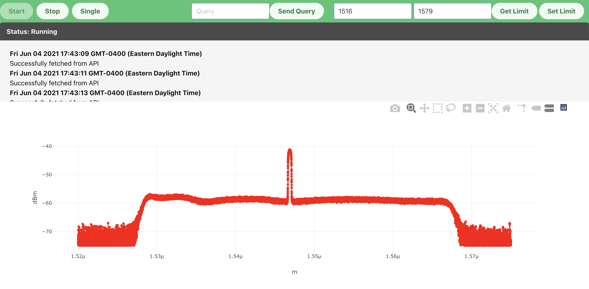

# Virtual Optical Spectrum Analyzer

This analyzer is deployed at https://floating-ocean-85341.herokuapp.com/. The source code can be found at https://github.com/Donglin-Wang2/ciena-fall-2021-coop-challenge. This is my submission for the coding challenge for the Fall 2021 "Instrumentation Automation Developer" Co-op position at Ciena. This Virttual Optical Sepctrum Analyzer has the following features:

1. It allows users to **start and stop** tracing the device data at 1Hz.
2. It allows users to acuire a single trace from the remote device.
3. It allows users to send queries to the device.
4. It allows users to set the range of data to be received.
5. It will generate logs when the device fail to connect, timed out, or returns no data.
6. It allows to zoom in, zoom out, and download the graph as a screenshot 
7. 

## Installation Guide

**Requirements: Make sure you have `npm` and `pip` installed**

1. Clone the repository onto your local machine.
2. In the root folder, run `npm install`. This will insall all modules needed to build and run the JavaScript frontend.
3. Run `python manage.py migrate` to apply all the migrations needed for Django to function properly.
4. Run `python manage.py runserver` to start the application on localhost. If your port 8000 is not occupied, then the application will be at `localhost:8000`.

If you want to change any part of the front-end code, be sure to run `npm run dev` in order to rebuild the JavaScript files along with React.js. If you want to change any part of the api, please run `python manage.py makemigrations` and then `python manage.py migrate` before running `python manage.py runserver`.

## API Endpoint

### Get device trace
* **URL**: 
  
    /api/trace
  
* **Method**: 
  
    `GET`

* **Data Params**: 
  
    None

* **Success Response**:

    * **Code**: 200
    * **Content**: Json file directly from the device API.

* **Error Response**:
    * **Code**: 503
    * **Content**: `{"msg": "Request timed out. Trying to fetch again..."}` or `{"msg": "Couldn't fetch the data from device. Trying to fetch again..."}`

### Query

* **URL**: 
  
    /api/query
  
* **Method**: 
  
    `POST`

* **Data Params**: 
  
    `query=[string]`

* **Success Response**:

    * **Code**: 200
    * **Content**: Plain text the same as the query with no special characters (e.g. "?" and "/")

* **Error Response**:
    * **Code**: 503
    * **Content**: `{"msg": "Cannot query the server. Please try again."}`

### Set Limit

* **URL**: 
  
    /api/limit
  
* **Method**: 
  
    `POST`

* **Data Params**: 
  
    `limit=[integer, integer]` **The array length must be 2!**

* **Success Response**:

    * **Code**: 200
    * **Content**: `+READY>OK`

* **Error Response**:
    * **Code**: 400
    * **Content**: `{"msg": "Invalid limit. Limit must be in range (1515, 1580) exclusive on both sides."}`
    OR
    * **Code**: 503
    * **Content**: `{"msg": "Couldn't fetch the limit from device. Please try again."}`

### Get Limit

* **URL**: 
  
    /api/limit
  
* **Method**: 
  
    `GET`

* **Data Params**: 
  
    None

* **Success Response**:

    * **Code**: 200
    * **Content**: `{limit: [<lower_limit>, <upper_limit]}`

* **Error Response**:
    * **Code**: 503
    * **Content**: `{"msg": "Couldn't fetch the limit from device. Please try again."}`